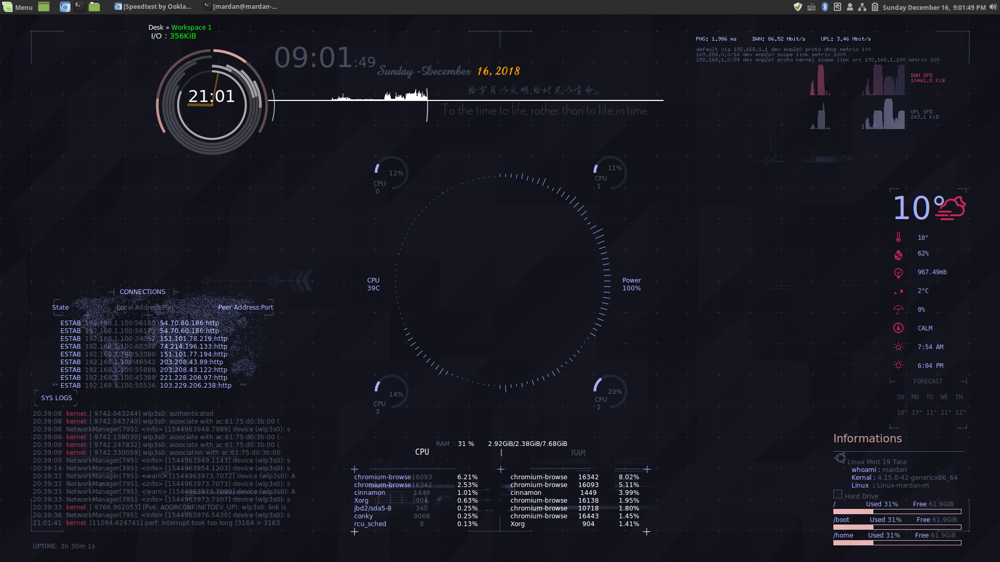

# **conky**

[conky文档](http://conky.sourceforge.net/docs.html)

Conky 是一个用于X窗口系统的系统监视软件。它可以运行在 GNU/Linux 和 FreeBSD 上，是一个基于GPL协议的免费软件。Conky 可以监控许多系统变量，包括 CPU，内存，交换分区，磁盘空间，温度，top，上传，下载，系统消息，以及更多。它具有很高的可配置性，但配置有一些难于理解。Conky是torsmo的一个分支。
```
sudo apt install conky-all
```

# Conky效果展示(conky Preview)




